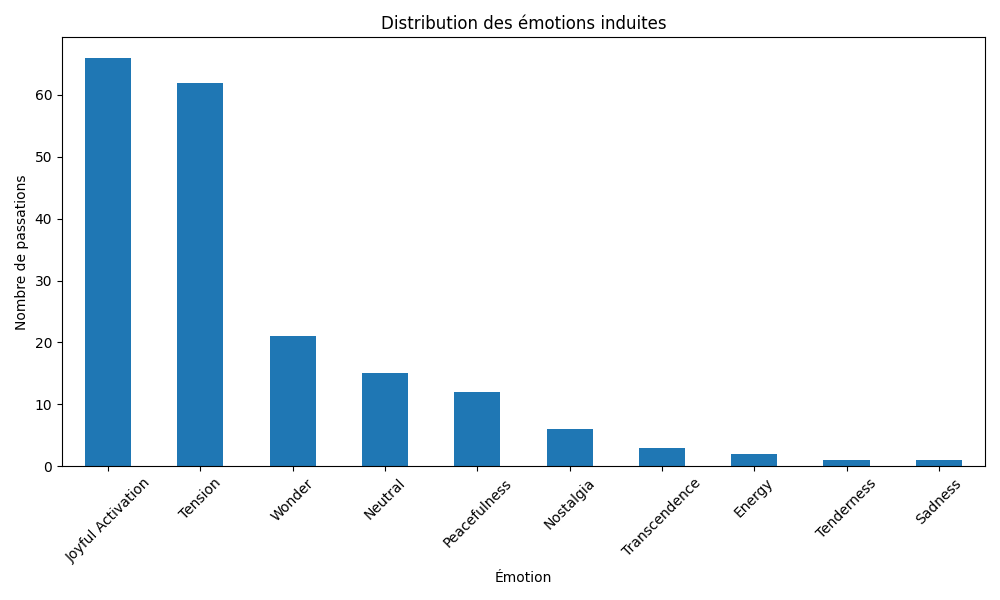
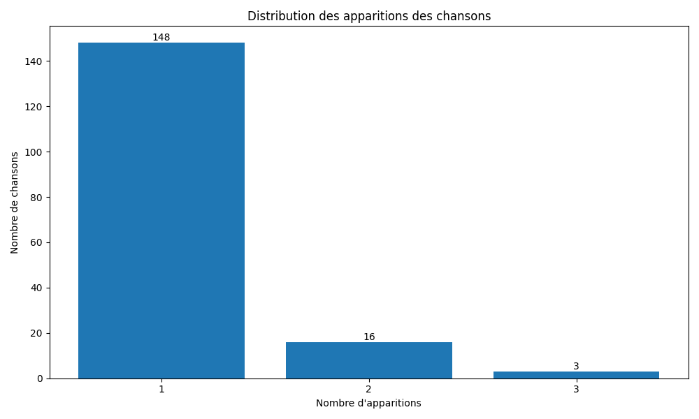
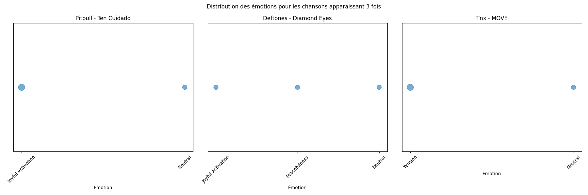
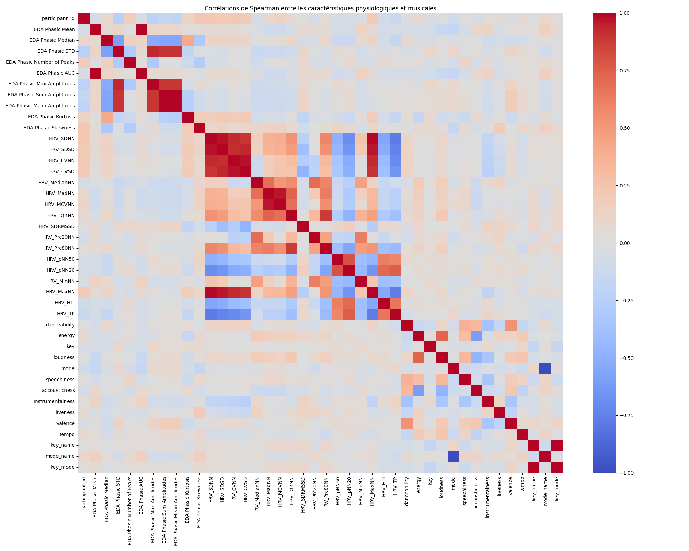
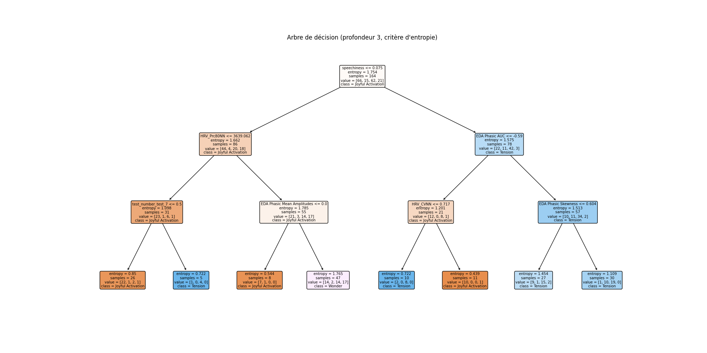

# Part 1
## Q1

## Q2

## Q3

## Q4

## Q6
Taille de l'ensemble d'entraînement: 102
Taille de l'ensemble de test: 26
---
Taille de l'ensemble d'entraînement: 102
Taille de l'ensemble de test: 26
---
Taille de l'ensemble d'entraînement: 102
Taille de l'ensemble de test: 26
---
Taille de l'ensemble d'entraînement: 103
Taille de l'ensemble de test: 25
---
Taille de l'ensemble d'entraînement: 103
Taille de l'ensemble de test: 25
---

# Part 2
## Q1

## Q2
Scores de précision micro pour chaque fold :
Fold 1: 0.5769
Fold 2: 0.6538
Fold 3: 0.4231
Fold 4: 0.3600
Fold 5: 0.7600

Précision micro moyenne : 0.5548
Écart-type de la précision micro : 0.1468
